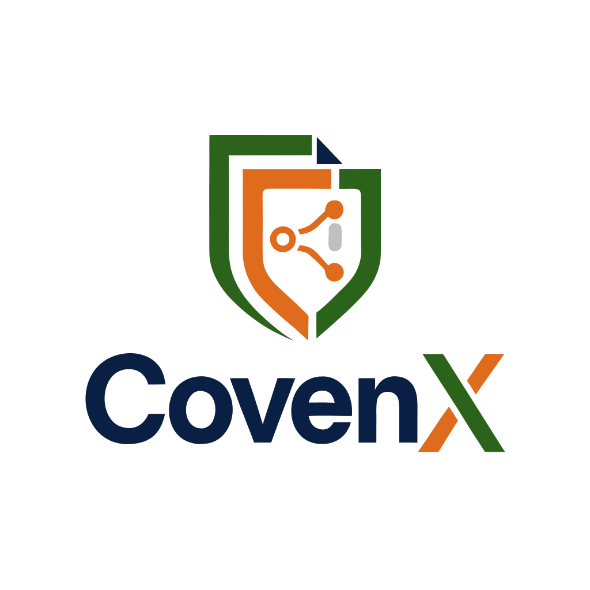

<p align="center">
  
</p>

<h1 align="center">CovenX — Enterprise Contract Lifecycle Management</h1>

<p align="center">
  <strong>A full-stack, production-grade CLM platform built for scale, security, and speed.</strong><br/>
  Manage 350,000+ contracts with real-time collaboration, AI risk scoring, multi-level approvals, and cryptographic digital signatures.
</p>

<p align="center">
  
  
  
  
  
  
  
  
</p>

---

## 📋 Table of Contents

- [Overview](#-overview)
- [Features](#-features)
- [Architecture](#-architecture)
- [Tech Stack](#-tech-stack)
- [Project Structure](#-project-structure)
- [Getting Started](#-getting-started)
  - [Prerequisites](#prerequisites)
  - [Installation](#installation)
  - [Environment Variables](#environment-variables)
  - [Running the App](#running-the-app)
- [API Reference](#-api-reference)
- [RBAC — Role-Based Access Control](#-rbac--role-based-access-control)
- [Real-time Features](#-real-time-features)
- [Brand & Design System](#-brand--design-system)
- [Contributing](#-contributing)
- [License](#-license)

---

## 🌐 Overview

**CovenX** is an enterprise-grade **Contract Lifecycle Management (CLM)** platform designed to handle the full contract journey — from authoring and templating through multi-level approval workflows, cryptographic digital signatures, SLA obligation tracking, and immutable audit trails.

Built as a **MERN monorepo** (MongoDB · Express · React · Node.js) with TypeScript throughout, it follows **Clean Architecture** principles with strict separation between controllers, services, repositories, and data models.

---

## ✨ Features

### 📝 Contract Authoring Studio
- Rich text contract editor with real-time autosave
- Dynamic template loading with `{{placeholder}}` variable substitution
- Clause library drawer — insert pre-approved legal clauses in one click
- AI-powered risk scoring engine (financial exposure, unlimited liability detection)

### 🔄 Approval Workflows
- Configurable multi-step approval chains (Legal → Finance → Executive)
- Step-by-step approval with comments and timestamps
- Real-time approval status updates via Socket.IO

### ✍️ Digital Signatures
- Cryptographic signature generation with verifiable hash
- Non-repudiation audit trail per signature event
- Signer role management (CLO, CFO, CEO, Vendor)

### 📊 Executive Analytics Dashboard
- Portfolio value tracking ($485M+ scale demo data)
- Department-level contract distribution with animated bar charts
- Real-time KPIs: total contracts, active, pending, expiring
- Live audit & activity log with color-coded event pills

### 📚 Template & Clause Library
- Pre-built legal templates: MSA, NDA, SLA, Procurement
- Centralised clause library with risk ratings (LOW / MEDIUM / HIGH)
- Create, store, and reuse legally verified clause blocks

### 🏛️ Immutable Audit Trail
- Every action logged with actor, role, IP address, and timestamp
- Tamper-proof event history per contract
- Full version history with content diff inspection

### 🔐 Security & RBAC
- JWT-based authentication with configurable expiry
- Four built-in roles: `ADMIN`, `LEGAL_REVIEWER`, `FINANCE_APPROVER`, `EXECUTIVE`
- Route-level middleware enforcement
- Redis session caching

### 🔁 Real-time Collaboration (Socket.IO)
- Multi-user document editing with live content broadcast
- Section locking — prevents concurrent edit conflicts
- Approval notification push to all connected clients

---

## 🏗️ Architecture

```
CovenX Monorepo
├── covenx-backend/          # Node.js + Express + TypeScript API
│   └── src/
│       ├── config/          # DB, Redis, Env configuration
│       ├── controllers/     # HTTP request handlers
│       ├── services/        # Business logic layer
│       ├── repositories/    # Data access layer (Mongoose)
│       ├── models/          # Mongoose schemas & models
│       ├── middleware/       # Auth, Error handling
│       ├── routes/          # Express route definitions
│       └── types/           # Shared TypeScript interfaces
│
└── covenx-frontend/         # React 19 + Vite + Tailwind CSS
    └── src/
        ├── components/
        │   ├── layout/      # Navbar, Sidebar
        │   ├── ui/          # Button, Card primitives
        │   ├── contracts/   # Status badges, Timeline, Signatures
        │   └── editor/      # Clause drawer, Risk panel
        ├── pages/           # Dashboard, ContractList, Editor, Templates, Login
        ├── store/           # Redux Toolkit + RTK Query API slices
        ├── context/         # ThemeContext (light/dark mode)
        └── types/           # Shared TypeScript types
```

**Backend follows Clean Architecture:**

```
HTTP Request → Router → Controller → Service → Repository → MongoDB
                              ↓
                        Redis Cache
                              ↓
                      Socket.IO Events
```

---

## 🛠️ Tech Stack

### Backend
| Technology | Version | Purpose |
|-----------|---------|---------|
| Node.js + Express | 4.19 | REST API server |
| TypeScript | 5.4 | Type safety |
| Mongoose | 8.3 | MongoDB ODM |
| Redis (`redis`) | 4.6 | Session caching & pub/sub |
| Socket.IO | 4.7 | Real-time collaboration |
| JSON Web Token | 9.0 | Authentication |
| bcryptjs | 2.4 | Password hashing |
| dotenv | 16.4 | Environment management |
| ts-node-dev | 2.0 | Hot reload dev server |

### Frontend
| Technology | Version | Purpose |
|-----------|---------|---------|
| React | 19 | UI framework |
| TypeScript | 5.4 | Type safety |
| Vite | 5.2 | Build tool & dev server |
| Tailwind CSS | 3.4 | Utility-first styling |
| Redux Toolkit + RTK Query | 2.2 | State & API management |
| React Router DOM | 6.22 | Client-side routing |
| Lucide React | 0.475 | Icon library |
| Inter (Google Fonts) | — | Typography |

### Infrastructure
| Service | Purpose |
|---------|---------|
| MongoDB Atlas | Cloud database |
| Redis Cloud | Session cache |
| GitHub | Source control |

---

## 📁 Project Structure

```
CovenX/
├── package.json                  # Monorepo root (npm workspaces)
├── README.md
│
├── covenx-backend/
│   ├── src/
│   │   ├── config/
│   │   │   ├── db.ts             # MongoDB connection
│   │   │   ├── redis.ts          # Redis client
│   │   │   └── env.ts            # Environment config
│   │   ├── controllers/
│   │   │   ├── auth.controller.ts
│   │   │   ├── contract.controller.ts
│   │   │   ├── analytics.controller.ts
│   │   │   ├── clause.controller.ts
│   │   │   ├── template.controller.ts
│   │   │   └── audit.controller.ts
│   │   ├── services/             # Business logic
│   │   ├── repositories/         # DB queries (Mongoose)
│   │   ├── models/               # Mongoose schemas
│   │   ├── middleware/
│   │   │   ├── auth.middleware.ts # JWT verification + RBAC
│   │   │   └── error.middleware.ts
│   │   ├── routes/               # Express routers
│   │   ├── types/                # Shared interfaces
│   │   └── server.ts             # App entry point + Socket.IO
│   ├── tsconfig.json
│   └── package.json
│
└── covenx-frontend/
    ├── public/
    │   └── logo.png              # CovenX brand logo
    ├── src/
    │   ├── components/
    │   ├── pages/
    │   ├── store/
    │   │   ├── api/
    │   │   │   ├── contractsApi.ts
    │   │   │   ├── analyticsApi.ts
    │   │   │   ├── templatesApi.ts
    │   │   │   └── auditApi.ts
    │   │   ├── authSlice.ts
    │   │   └── index.ts
    │   ├── context/
    │   │   └── ThemeContext.tsx
    │   ├── types/
    │   ├── App.tsx
    │   ├── main.tsx
    │   └── index.css
    ├── tailwind.config.js
    ├── vite.config.ts
    └── package.json
```

---

## 🚀 Getting Started

### Prerequisites

Make sure you have the following installed:

- **Node.js** ≥ 18.x → [Download](https://nodejs.org/)
- **npm** ≥ 9.x (comes with Node.js)
- **MongoDB Atlas** account → [Sign up free](https://www.mongodb.com/atlas)
- **Redis** (local or [Redis Cloud](https://redis.io/cloud/))
- **Git**

---

### Installation

**1. Clone the repository**

```bash
git clone https://github.com/AhmedBinAmeer/covenx.git
cd covenx
```

**2. Install all dependencies (monorepo)**

```bash
# Install root + both workspaces in one command
npm install
```

> This installs dependencies for both `covenx-backend` and `covenx-frontend` via npm workspaces.

---

### Environment Variables

**Create the backend `.env` file:**

```bash
# covenx-backend/.env
```

```env
PORT=5000
NODE_ENV=development

# MongoDB Atlas — get from: Atlas → Connect → Drivers → Node.js
# Use the SRV format for best compatibility:
MONGODB_URI=mongodb+srv://<username>:<password>@<cluster>.mongodb.net/<dbname>?retryWrites=true&w=majority

# Redis — local or Redis Cloud connection string
REDIS_URL=redis://localhost:6379

# JWT — change this to a long random string in production
JWT_SECRET=your_super_secret_jwt_key_change_in_production
JWT_EXPIRES_IN=7d

# CORS — your frontend URL
CORS_ORIGIN=http://localhost:5173
```

> **⚠️ Important:** Never commit `.env` to source control. It is already in `.gitignore`.

**MongoDB Atlas setup:**
1. Create a free cluster at [mongodb.com/atlas](https://www.mongodb.com/atlas)
2. Go to **Network Access** → Add your current IP address
3. Go to **Database Access** → Create a user with read/write permissions
4. Go to **Clusters → Connect → Drivers** → Copy the connection string

---

### Running the App

#### Option A — Run both servers simultaneously

```bash
# From the monorepo root
npm run dev:backend   # Terminal 1 — starts backend on port 5000
npm run dev:frontend  # Terminal 2 — starts frontend on port 5173
```

#### Option B — Run from individual directories

```bash
# Backend
cd covenx-backend
npm run dev

# Frontend (new terminal)
cd covenx-frontend
npm run dev
```

#### Option C — Docker (local MongoDB, no Atlas needed)

```bash
# Start a local MongoDB instance
docker run -d --name covenx-mongo -p 27017:27017 mongo:latest

# Then set in .env:
# MONGODB_URI=mongodb://localhost:27017/covenx
```

---

**Access the app:**

| Service | URL |
|---------|-----|
| 🌐 Frontend | http://localhost:5173 |
| ⚙️ Backend API | http://localhost:5000 |
| 🏥 Health Check | http://localhost:5000/health |

---

### Building for Production

```bash
# Build both packages
npm run build

# Start production backend
cd covenx-backend
npm start
```

---

## 📡 API Reference

All routes are prefixed with `/api/v1`.

### Authentication
| Method | Endpoint | Description | Auth |
|--------|----------|-------------|------|
| `POST` | `/auth/register` | Register new user | Public |
| `POST` | `/auth/login` | Login + get JWT | Public |
| `GET` | `/auth/me` | Get current user | 🔒 JWT |

### Contracts
| Method | Endpoint | Description | Auth |
|--------|----------|-------------|------|
| `GET` | `/contracts` | List all contracts (filterable) | 🔒 JWT |
| `POST` | `/contracts` | Create new contract | 🔒 JWT |
| `GET` | `/contracts/:id` | Get contract by ID | 🔒 JWT |
| `PATCH` | `/contracts/:id/content` | Update content + version bump | 🔒 JWT |
| `POST` | `/contracts/:id/submit` | Submit for approval | 🔒 JWT |
| `POST` | `/contracts/:id/approve` | Approve a workflow step | 🔒 JWT |
| `POST` | `/contracts/:id/sign` | Execute digital signature | 🔒 JWT |
| `POST` | `/contracts/:id/obligations` | Add post-signature obligation | 🔒 JWT |

### Analytics
| Method | Endpoint | Description | Auth |
|--------|----------|-------------|------|
| `GET` | `/analytics/dashboard` | Executive KPI metrics | 🔒 JWT |

### Templates & Clauses
| Method | Endpoint | Description | Auth |
|--------|----------|-------------|------|
| `GET` | `/templates` | List all templates | 🔒 JWT |
| `GET` | `/clauses` | List all clauses | 🔒 JWT |
| `POST` | `/clauses` | Create new clause | 🔒 JWT |

### Audit
| Method | Endpoint | Description | Auth |
|--------|----------|-------------|------|
| `GET` | `/audit/:contractId` | Get audit logs for contract | 🔒 JWT |

### Health
| Method | Endpoint | Description |
|--------|----------|-------------|
| `GET` | `/health` | Server health check |

---

## 🔐 RBAC — Role-Based Access Control

CovenX uses **4 built-in roles** enforced at the middleware layer:

| Role | Access Level | Capabilities |
|------|-------------|--------------|
| `ADMIN` | Full access | All operations, user management, system config |
| `LEGAL_REVIEWER` | Legal scope | View, edit contracts; manage clauses; approve legal steps |
| `FINANCE_APPROVER` | Finance scope | Review contract values; approve finance workflow steps |
| `EXECUTIVE` | Executive scope | Final approval; execute digital signatures |

**Demo Quick-Switch** available on the Login page — click any persona to instantly authenticate as that role.

---

## 🔁 Real-time Features

CovenX uses **Socket.IO** for live collaboration. Events:

| Event (Client → Server) | Description |
|------------------------|-------------|
| `join-contract` | Join a contract's editing room |
| `acquire-lock` | Lock a section for exclusive editing |
| `release-lock` | Release section lock |
| `edit-content` | Broadcast live content changes |
| `approval-updated` | Notify all clients of approval status change |

| Event (Server → Client) | Description |
|------------------------|-------------|
| `lock-acquired` | Section lock granted |
| `lock-failed` | Section already locked by another user |
| `lock-released` | Section unlocked |
| `content-updated` | Live content update from another user |
| `notification` | Global approval/system notification |

---

## 🎨 Brand & Design System

CovenX uses a custom **3-color brand palette** extracted from the company logo:

| Token | Hex | Usage |
|-------|-----|-------|
| `navy` | `#1B2D5E` | Primary — CTAs, sidebar active, headings |
| `forest` | `#2D6A27` | Success — executed contracts, clauses, value figures |
| `ember` | `#E8650A` | Accent — pending items, notifications, "X" in logo |

**Design features:**
- Full **light / dark mode** with persistent toggle (no forced overrides)
- **Inter** typeface via Google Fonts
- Gradient utilities: `gradient-navy-green`, `gradient-navy-ember`
- Custom shadow tokens: `shadow-brand-sm/md`, `shadow-forest-sm`, `shadow-ember-sm`
- `mix-blend-mode: multiply` for logo background transparency in light mode

---

## 🤝 Contributing

1. Fork the repository
2. Create a feature branch: `git checkout -b feat/your-feature`
3. Commit your changes: `git commit -m "feat: describe your change"`
4. Push to the branch: `git push origin feat/your-feature`
5. Open a Pull Request

---

## 📄 License

This project is licensed under the **MIT License**.

---

<p align="center">
  Built with ❤️ by <a href="https://github.com/AhmedBinAmeer">Ahmed Bin Ameer</a>
  <br/>
  
</p>
