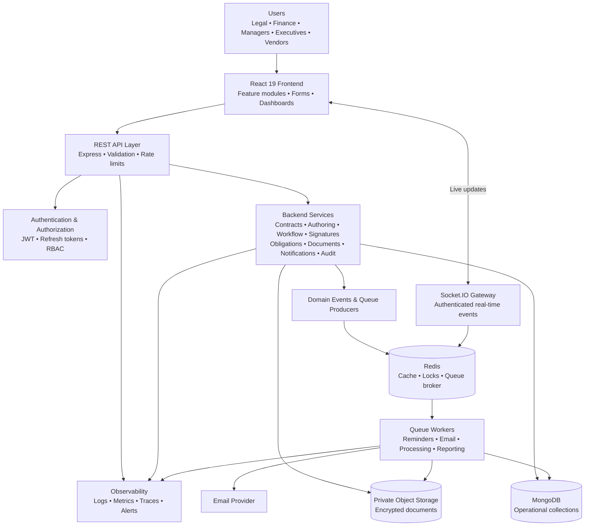
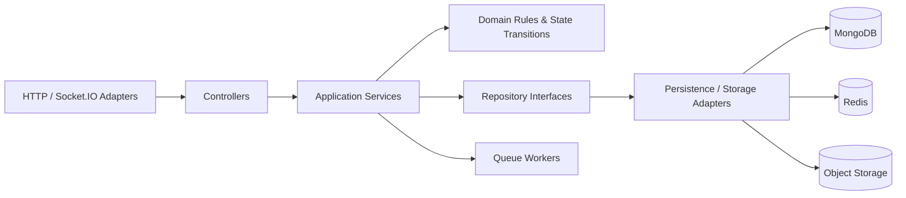
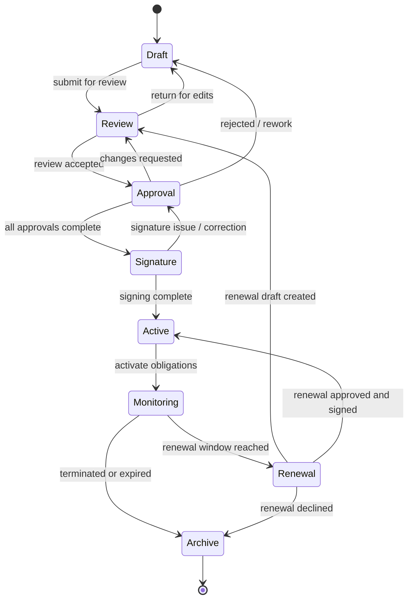
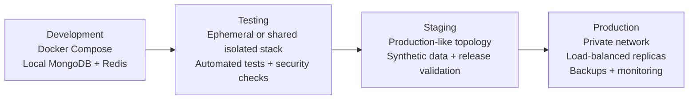

# CovenX Enterprise Contract Lifecycle Management Platform

## System Architecture Document

**Status:** Architecture baseline for review
**Version:** 1.0
**Audience:** Product, engineering, security, operations, and enterprise stakeholders
**Scope:** Technical blueprint only; application implementation is intentionally out of scope for this document milestone.

> CovenX transforms contract operations from manual document handling into secure, searchable, actionable business workflows through lifecycle automation, compliance monitoring, obligation tracking, and contract intelligence.

## 1. Architecture Overview

### 1.1 Product context

The **CovenX Enterprise Contract Lifecycle Management Platform** is an enterprise SaaS platform for managing contracts from creation through review, approval, signature, active monitoring, renewal, and archival. It serves legal officers, department managers, finance reviewers, executive approvers, and vendor users across distributed business units.

CovenX addresses lost contracts, slow approval cycles, version conflicts, missed renewal dates, weak contract visibility, manual coordination, and compliance exposure. The architecture therefore treats a contract as a governed business record with associated versions, documents, approvals, signatures, obligations, notifications, and immutable audit events rather than as an isolated file.

### 1.2 System goals

The architecture is designed to centralize contract records; automate multi-level approvals; preserve complete version and audit history; secure documents and external collaboration; surface obligations and renewal risk; support executive reporting; and provide a foundation for future OCR, clause extraction, risk scoring, full-text search, integrations, and multi-tenant SaaS capabilities.

The non-functional baseline is capacity for **500,000 contracts** and **25,000 concurrent users**, with horizontal scaling, query-oriented indexing, Redis caching, background processing, secure file handling, and complete audit logging.

### 1.3 Architectural approach

CovenX uses a **modular monolith as the initial deployable boundary**, organized internally according to Clean Architecture and feature-oriented modules. This provides a coherent transaction boundary and lower operational complexity during initial delivery while preserving seams for extracting high-volume or independently scaled workloads later.

The backend follows:

> Controller → Service → Repository → Database

Controllers translate HTTP requests and responses. Services own business rules and lifecycle transitions. Repositories abstract persistence operations. Models define persistence shape and validation boundaries. Events record meaningful domain changes, while queue workers execute asynchronous notifications, indexing, document processing, and scheduled checks.

The platform uses a React and TypeScript frontend, a Node.js and Express API layer, MongoDB for durable operational data, Redis for caching and queue coordination, Socket.IO for authenticated real-time updates, object storage for binary documents, JWT access tokens with refresh-token rotation, RBAC and permission checks, and containerized delivery through CI/CD.

### 1.4 Major components

| Component | Responsibility | Primary boundary |
|---|---|---|
| React frontend | Feature-based user experience, forms, dashboards, workflow actions, and controlled document views | Browser client |
| API layer | REST resources, authentication, validation, rate limits, correlation IDs, and response shaping | Stateless HTTP service |
| Backend modules | Contract, authoring, workflow, signature, obligation, document, notification, audit, and reporting capabilities | Application and domain services |
| MongoDB | Durable contract and identity records, workflow state, metadata, and audit projections | Operational database |
| Redis | Short-lived cache, rate limiting, distributed locks, queue broker, and presence/session coordination | Shared infrastructure service |
| Queue workers | Reminder scheduling, email dispatch, document processing, reporting jobs, and future OCR/indexing | Asynchronous execution |
| Object storage | Encrypted binary files, attachments, amendments, scanned copies, and immutable document versions | Private storage boundary |
| Socket.IO gateway | Authenticated lifecycle updates, approval updates, notifications, and dashboard refresh signals | Real-time channel |
| Identity and access layer | JWT issuance, refresh rotation, RBAC, permissions, session revocation, and tenant/context checks | Cross-cutting security |
| Audit subsystem | Append-only activity records and traceability for user, contract, document, approval, download, and status events | Compliance boundary |

## 2. High-Level Architecture

### 2.1 Logical flow



### 2.2 Request and data boundaries

The frontend never connects directly to MongoDB, Redis, object storage credentials, or the email provider. It calls the REST API using an access token and receives resource representations shaped for the current user’s permissions. Document uploads use a controlled upload-initiation API that returns a short-lived, scoped object-storage upload capability; finalization is performed through the API so metadata, virus-scanning status, ownership, and audit records remain authoritative.

The API and workers are stateless at the process level. Durable state lives in MongoDB and object storage, while Redis contains recoverable or expiring coordination state. Domain events are persisted or made recoverable at the transactional boundary through an outbox-style event record before asynchronous publication. This prevents a contract mutation from committing without its downstream notification or audit intent being recorded.

### 2.3 Trust zones

| Zone | Examples | Controls |
|---|---|---|
| User zone | Browser, vendor browser, corporate identity context | TLS, secure cookies or token storage policy, CSP, CSRF strategy where cookies are used |
| Edge/API zone | Load balancer, API ingress, Socket.IO gateway | WAF, rate limiting, request size limits, schema validation, correlation IDs |
| Application zone | Controllers, services, workers | Least privilege, service boundaries, secret injection, structured logging, authorization at resource and action level |
| Data zone | MongoDB, Redis, object storage | Private networking, encryption, backups, restricted service identities, retention policy |
| Operations zone | CI/CD, monitoring, alerting, administrative tooling | Strong operator authentication, separation of duties, immutable deployment records |

### 2.4 Rendered diagram assets

The editable Mermaid sources and rendered review assets are maintained together:

| Diagram | Source | Rendered asset |
|---|---|---|
| High-level architecture | [`high-level-architecture.mmd`](../architecture/diagrams/high-level-architecture.mmd) | [`high-level-architecture.png`](../architecture/diagrams/high-level-architecture.png) |
| Contract lifecycle workflow | [`contract-lifecycle.mmd`](../architecture/diagrams/contract-lifecycle.mmd) | [`contract-lifecycle.png`](../architecture/diagrams/contract-lifecycle.png) |
| Deployment pipeline | [`deployment-pipeline.mmd`](../architecture/diagrams/deployment-pipeline.mmd) | [`deployment-pipeline.png`](../architecture/diagrams/deployment-pipeline.png) |

## 3. Frontend Architecture

### 3.1 React application structure

The frontend is a React 19 and TypeScript application using a feature-based structure. Pages compose features; features compose reusable components and hooks; services own API and integration concerns; and the store contains cross-feature client state. The frontend must not duplicate backend business rules or infer authorization from visual state alone. Every protected action is revalidated by the API.

```text
frontend/
├── src/                 # Application bootstrap and global styles
├── components/          # Cross-feature reusable presentation components
├── features/            # Domain modules: auth, contracts, workflows, dashboard, etc.
├── pages/               # Route-level composition and page layouts
├── hooks/               # Shared React hooks and lifecycle adapters
├── services/            # API clients, upload clients, and external adapters
├── store/               # Redux Toolkit slices, query cache, and selectors
├── routes/              # Route definitions, guards, and navigation metadata
└── utils/               # Pure helpers, formatters, and client-side utilities
```

### 3.2 Folder responsibilities

| Folder | Responsibility | Must avoid |
|---|---|---|
| `src/` | Bootstrap, providers, global CSS, and application shell wiring | Domain-specific feature logic |
| `components/` | Reusable buttons, tables, badges, dialogs, form primitives, and layout elements | Direct persistence or workflow mutation logic |
| `features/` | Contract-centric UI behavior, forms, workflow actions, document views, and feature-local state | Cross-feature duplication and hidden global side effects |
| `pages/` | Route-level composition, loading boundaries, and page metadata | Large reusable components and API implementation |
| `hooks/` | Reusable stateful browser behavior and query/mutation adapters | Security decisions that belong on the server |
| `services/` | Typed REST client, upload orchestration, Socket.IO adapter, and error normalization | Rendering and business-policy duplication |
| `store/` | Session state, user context, UI preferences, and server-cache integration | Storing secrets or unbounded document binaries |
| `routes/` | Route registration, lazy loading, access hints, and navigation | Authoritative authorization |
| `utils/` | Pure deterministic formatting and validation helpers | Mutable global state and API calls |

### 3.3 State management and API strategy

Redux Toolkit owns durable client state such as the authenticated user context, tenant or business-unit context, feature flags, and controlled UI state. React Query owns server-state fetching, caching, invalidation, optimistic update coordination, retries, and stale-time policies. The architecture avoids maintaining a second hand-written cache of contract data in Redux.

REST APIs use typed request and response contracts. Every mutation returns the resulting resource version or a stable operation identifier. Query keys include the relevant tenant, business unit, user scope, and resource identifiers. Socket.IO events invalidate or selectively update query data; they are hints for freshness and never replace the REST API as the source of truth.

Forms use React Hook Form with schema-based validation and accessible error rendering. Long-running actions such as document processing, bulk renewal reminders, and report generation return an operation status and are monitored through polling or authenticated Socket.IO events.

### 3.4 UI security and usability

The UI hides unavailable actions for usability but relies on API authorization for security. Route guards prevent accidental navigation into inaccessible areas. Document previews use time-limited URLs or a protected streaming endpoint, avoid exposing storage keys, and show classification and download warnings where configured. Loading, empty, error, retry, and permission-denied states are first-class states for every enterprise workflow view.

## 4. Backend Architecture

### 4.1 Clean Architecture layers



### 4.2 Module boundaries

| Module | Core responsibilities | Representative events |
|---|---|---|
| Identity and access | Users, roles, permissions, sessions, refresh-token rotation, and access context | `UserAuthenticated`, `SessionRevoked` |
| Contract repository | Contract metadata, parties, dates, values, status, search filters, and lifecycle aggregate coordination | `ContractCreated`, `ContractUpdated` |
| Authoring and versions | Templates, clauses, variables, draft creation, revisions, comparison, and rollback policy | `ContractVersionCreated`, `VersionRestored` |
| Workflow | Approval definitions, tasks, assignments, escalation, rejection, delegation, and state transitions | `ApprovalTaskAssigned`, `ApprovalCompleted` |
| Signature | Internal approval signatures, external signing status, provider adapters, and signature evidence | `SignatureRequested`, `SignatureCompleted` |
| Obligations | Payment, service, deliverable, SLA, renewal, and compliance obligations | `ObligationDue`, `ObligationCompleted` |
| Documents | Upload initiation, metadata, malware scanning status, access policy, versions, and retention | `DocumentUploaded`, `DocumentQuarantined` |
| Notifications | In-app, email, reminder policy, preference resolution, deduplication, and delivery status | `NotificationQueued`, `NotificationDelivered` |
| Audit | Append-only audit events, actor context, before/after summaries, and export controls | `AuditRecorded` |
| Reporting | Dashboard projections, aggregates, filters, and asynchronous report jobs | `DashboardProjectionRefreshed` |

### 4.3 Layer responsibilities

Controllers authenticate the request context, validate transport input, invoke a service, and map known outcomes to stable HTTP responses. They do not query MongoDB directly or implement lifecycle policy.

Services coordinate use cases and transactions. They enforce authorization requirements, validate state transitions, resolve related entities, create audit intents, publish domain events, and return application-level results. Services should be deterministic and testable without an HTTP server.

Repositories expose use-case-oriented persistence interfaces. They encapsulate MongoDB queries, projections, pagination, optimistic concurrency checks, and transaction participation. Repository methods must make tenant and authorization scope explicit rather than relying on callers to remember filters.

Models define persistence schemas, field constraints, timestamps, version fields, and indexes. They are not the primary location for cross-aggregate workflow rules. Middleware handles authentication, authorization context, validation, request IDs, rate limits, error normalization, and security headers.

Events describe business facts, not commands. Queue workers consume durable jobs idempotently, record attempts and outcomes, and use exponential backoff with a dead-letter policy. External providers are reached through adapters so the core application is not coupled to one email, signing, OCR, or search vendor.

## 5. Database Architecture

### 5.1 MongoDB strategy

MongoDB is the durable operational store because CovenX has document-shaped aggregates, evolving metadata, variable clause and obligation structures, and a need to retain contract versions and audit context. The design uses references between major aggregates rather than embedding unbounded histories inside a contract document. Small, read-together value objects may be embedded when their lifecycle is owned by the parent.

All major entities carry `createdAt`, `updatedAt`, `createdBy`, and `updatedBy`. Mutable records include an optimistic concurrency field such as `version` or an equivalent compare-and-set token. Tenant, business-unit, and data-classification scope are included in authorization-sensitive collections even if the initial deployment is single-tenant.

The target of 500,000 contracts requires bounded documents, selective projections, cursor-based pagination, compound indexes aligned to actual query patterns, and an explicit plan for future sharding. Indexes are created and reviewed through migrations; ad hoc production index creation is prohibited.

### 5.2 Collection catalogue

| Collection | Purpose | Important fields | Relationships | Index strategy |
|---|---|---|---|---|
| `users` | Human and vendor identities | `tenantId`, `email`, `status`, `roleIds`, `businessUnitIds`, `authVersion`, timestamps | References roles, permissions through role assignments, sessions | Unique `{tenantId, normalizedEmail}`; `{tenantId, status}` |
| `roles` | Named RBAC bundles | `tenantId`, `name`, `permissionIds`, `scopeRules` | References permissions | Unique `{tenantId, name}` |
| `permissions` | Atomic action-resource capabilities | `key`, `resource`, `action`, `description` | Referenced by roles | Unique `key`; index `{resource, action}` |
| `contracts` | Current contract aggregate and searchable metadata | `tenantId`, `contractNumber`, `title`, `type`, `businessUnitId`, `partyIds`, dates, `status`, `currentVersionId`, value fields | References users, parties, versions, workflows, obligations, documents | Unique `{tenantId, contractNumber}`; `{tenantId, status, expiryDate}`; `{tenantId, businessUnitId, status}` |
| `contractVersions` | Immutable or append-only contract revisions | `contractId`, `versionNumber`, `state`, `contentRef`, `checksum`, `createdBy`, `changeSummary` | Belongs to contract; references documents and clauses | Unique `{contractId, versionNumber}`; `{contractId, createdAt}` |
| `templates` | Reusable authoring blueprints | `tenantId`, `name`, `contractType`, `status`, `currentVersion`, `clauseRefs` | References clauses and owners | `{tenantId, contractType, status}`; unique scoped name |
| `clauses` | Governed clause library | `tenantId`, `key`, `title`, `body`, `riskLevel`, `status`, tags | Referenced by templates and versions | Unique `{tenantId, key}`; `{tenantId, status, riskLevel}` |
| `approvalWorkflows` | Versioned approval definitions | `tenantId`, `name`, `triggerRules`, `steps`, `status` | Referenced by contracts and tasks | `{tenantId, status}`; rule lookup indexes as needed |
| `approvalTasks` | Actionable approval work items | `contractId`, `workflowId`, `stepKey`, `assigneeId`, `status`, due date, decision | Belongs to workflow and contract; references actor | `{tenantId, assigneeId, status, dueDate}`; `{contractId, status}` |
| `signatures` | Internal and external signature evidence | `contractId`, `versionId`, `signerId`, `provider`, `status`, timestamps, evidenceRef | Belongs to contract version | `{tenantId, status, updatedAt}`; `{contractId, status}` |
| `obligations` | Contract commitments and due dates | `contractId`, `type`, `ownerId`, `dueDate`, `status`, recurrence, evidenceRefs | Belongs to contract; references owner and documents | `{tenantId, status, dueDate}`; `{contractId, dueDate}` |
| `notifications` | In-app and delivery records | `recipientId`, `type`, `entityRef`, `dedupeKey`, `status`, scheduled/delivered times | References source entity and user | Unique scoped `dedupeKey`; `{recipientId, status, createdAt}` |
| `documents` | File metadata and security state | `tenantId`, `contractId`, `versionId`, `objectKey`, `checksum`, `mimeType`, size, classification, scanStatus, retention | Belongs to contract/version; points to object storage | `{tenantId, contractId, createdAt}`; `{tenantId, scanStatus}` |
| `auditLogs` | Append-only compliance history | `tenantId`, `actorId`, action, resource, resourceId, requestId, occurredAt, beforeSummary, afterSummary, metadata | References actor and target resource without owning it | `{tenantId, resource, resourceId, occurredAt}`; `{tenantId, actorId, occurredAt}`; time-based retention strategy |

`parties`, `sessions`, `refreshTokens`, `outboxEvents`, `jobRecords`, and `dashboardProjections` are supporting collections that should be introduced as their owning modules require them. They follow the same scope, timestamp, audit, and index discipline.

### 5.3 Consistency and transaction policy

A MongoDB transaction is used when a use case changes multiple documents that must agree immediately, such as completing an approval and advancing the contract state. The transaction remains short and does not include external network calls. External side effects are represented as outbox or queue records and processed after commit.

The contract lifecycle state is authoritative on the `contracts` aggregate. Derived dashboard counts, notification projections, and search indexes are eventually consistent and must display freshness metadata when material for users. Idempotency keys protect retried mutations and job executions.

## 6. Authentication and Authorization Architecture

### 6.1 Authentication

CovenX uses short-lived JWT access tokens containing a user identifier, tenant identifier, session identifier, authentication version, and minimal authorization context. Refresh tokens are long-lived, opaque, stored hashed, rotated on use, bound to a session record, and revoked on reuse detection, logout, password reset, or administrative action. Access tokens are never used as refresh tokens.

The preferred browser policy is an HTTP-only, Secure, SameSite-controlled refresh cookie plus an in-memory access token. Cross-origin deployment requires an explicit origin allowlist and CSRF protection appropriate to the chosen cookie policy. Passwords are stored only as slow, salted password hashes. Authentication responses never expose password hashes, refresh tokens, signing secrets, or provider credentials.

### 6.2 RBAC and permission model

RBAC provides coarse role bundles while atomic permissions provide precise action control. Resource-level scope rules then constrain a permission to a tenant, business unit, department, contract ownership set, or assigned workflow task.

```text
permission = <resource>:<action>
examples:
  contract:read
  contract:create
  contract:update
  contract:submit-review
  contract:approve
  contract:archive
  document:upload
  document:download
  workflow:configure
  obligation:manage
  audit:read
  report:read
  user:manage
```

Authorization is evaluated at the API boundary and again inside the service before the sensitive mutation. A role is not itself a guarantee of access: the user must have the permission and the requested resource must satisfy scope rules. Vendor users are isolated to explicitly shared contracts and documents. Executive dashboards use aggregate permissions and must not become a side channel for unauthorized contract detail.

### 6.3 Session handling

Each session has a device or client label, creation time, last-used time, expiry, revocation state, and authentication version. Administrative revocation increments the user’s authentication version or revokes all session records. Redis may accelerate revocation checks, but MongoDB remains the durable source for session evidence. Authentication and authorization decisions emit audit events without recording secrets.

## 7. Contract Lifecycle Workflow Architecture

### 7.1 Lifecycle



### 7.2 State and transition rules

| State | Meaning | Permitted transitions | Required evidence |
|---|---|---|---|
| Draft | Editable working version not yet submitted | Review | Owner, current version, required metadata |
| Review | Legal or designated reviewers assess content | Draft, Approval | Review task decisions, comments, version checksum |
| Approval | Required business, finance, legal, or executive decisions are pending | Review, Draft, Signature | Approval tasks, decisions, delegation/escalation trail |
| Signature | Approved version is being signed internally or externally | Approval, Active | Signer list, signature status, evidence or simulated record |
| Active | Signed contract is in force | Monitoring, Renewal, Archive | Effective date, signed version, parties, obligations |
| Monitoring | Active contract obligations and compliance dates are tracked | Renewal, Archive | Obligation schedule and ownership |
| Renewal | Renewal work is being prepared or evaluated | Review, Active, Archive | Renewal task, proposed version, decision evidence |
| Archive | Contract is inactive and retained according to policy | Terminal | Archive reason, retention class, final audit event |

Every transition is validated against the current state, actor permission, required fields, outstanding tasks, and concurrency token. Rejected transitions return a typed business error and do not partially mutate the contract. Automatic transitions, such as entering a renewal window, run through the same transition service as user actions and identify the scheduler as the initiating actor.

## 8. Notification Architecture

Redis is used for queue coordination, short-lived locks, rate limiting, and cache entries. A queue producer creates an idempotent job for each notification intent. Workers resolve recipient preferences and current authorization at delivery time, render a versioned template, send through the configured email adapter, and record delivery status.

Notification classes include pending approvals, escalations, missing signatures, expiry and renewal reminders, SLA deadlines, compliance reviews, document scan outcomes, and relevant in-app lifecycle events. Dedupe keys prevent repeated reminders for the same event window. Retries use exponential backoff; poison jobs move to a dead-letter queue and produce an operational alert.

Socket.IO is used for authenticated, low-latency in-app updates such as task assignment, approval completion, notification arrival, and dashboard freshness. Connections are associated with a user and tenant context after token validation. The server checks authorization before emitting room-scoped events. Clients treat events as invalidation signals and refetch authoritative data.

## 9. Document Storage Architecture

### 9.1 Upload process

1. The user requests an upload session for a specific contract or version, declaring filename, size, MIME type, and document classification.
2. The API verifies the user’s `document:upload` permission and resource scope, creates a pending document metadata record, and returns a short-lived scoped upload capability.
3. The browser uploads directly to private object storage using a constrained key and size/type policy.
4. A storage event or finalize request marks the document as uploaded and queues malware scanning, checksum verification, metadata extraction, and optional OCR.
5. Only a clean, verified document becomes downloadable. Quarantined, failed, or incomplete objects are inaccessible to ordinary users and are removed according to retention policy.
6. The API records the document-to-contract/version relationship and emits an audit event.

### 9.2 Metadata, access, and security

MongoDB stores metadata and status; object storage stores encrypted binary content. Object keys contain opaque identifiers rather than user-controlled names or sensitive business data. Downloads use short-lived signed URLs or an authenticated streaming endpoint. The authorization service checks tenant, contract, document classification, user scope, and action permission before issuing access.

Allowed MIME types, file size limits, content-disposition policy, malware scanning, checksum verification, encryption at rest, TLS in transit, retention and legal-hold rules, and download auditing are mandatory controls. The platform must not render untrusted office or HTML content in a privileged origin without sandboxing. Versioned documents are immutable after verification; a replacement creates a new document/version record.

## 10. Audit Architecture

CovenX maintains an append-only audit trail for user actions, contract creation and change, version creation and rollback, approval decisions, signature activity, obligation changes, document upload/download, status transitions, authentication events, authorization failures, and administrative configuration changes.

Each audit event includes a tenant, actor or system identity, action name, resource type and identifier, timestamp, request/correlation ID, source channel, result, reason where applicable, and safe before/after summaries. Sensitive values are redacted or represented by hashes. Audit records are not updated to rewrite history; corrections are represented by a subsequent event.

The audit subsystem is invoked from the application service boundary so direct controller paths cannot bypass it. High-value events are written within the same transaction as the business change where possible. A durable outbox or equivalent recovery mechanism handles downstream export or alerting. Access to audit search and export is permissioned, rate-limited, and itself audited. Retention, legal hold, export format, and regional residency are policy decisions that must be configurable without weakening immutability.

## 11. Scalability Architecture

The target workload is 500,000 contracts and 25,000 concurrent users. The architecture scales through stateless API replicas behind a load balancer, Socket.IO connection management with a Redis adapter, horizontally scaled queue workers, private object storage for binary content, and MongoDB replica sets with a documented path to sharding.

| Concern | Design response |
|---|---|
| Contract queries | Compound indexes on tenant/status/date, business unit, assignee, and expiry; projections; cursor pagination; bounded filters |
| High read volume | Redis cache for safe, short-lived reference and dashboard data; explicit invalidation on mutation; no cache as authorization source |
| Concurrent connections | Horizontally scaled Socket.IO gateways with Redis pub/sub adapter and connection limits |
| Long-running work | Queue workers for reminders, mail, document processing, reporting, and future OCR/search indexing |
| Binary content | Object storage rather than MongoDB documents; CDN only for explicitly authorized, time-limited access |
| Database growth | Replica sets, workload-specific indexes, archive/retention policies, partition or shard-key evaluation before scale threshold |
| API resilience | Load balancing, timeouts, bounded payloads, rate limits, circuit breakers around external providers |
| Observability | Metrics for latency, queue depth, error rate, cache hit rate, database saturation, Socket.IO connections, and job age |

Load testing must represent read-heavy dashboards, filtered contract searches, approval bursts, document uploads, concurrent Socket.IO connections, and reminder-worker peaks. Capacity assumptions are validated before production claims are made.

## 12. Security Architecture

Security is applied in depth. Authentication uses JWT access tokens and rotated refresh sessions. Authorization combines RBAC, atomic permissions, tenant/business-unit/resource scope, and server-side checks. APIs apply TLS, secure headers, strict CORS, request schema validation, payload limits, rate limiting, correlation IDs, safe error responses, and dependency scanning.

MongoDB, Redis, object storage, and queues reside on private network paths and use service-specific credentials with least privilege. Secrets are injected through deployment configuration or a managed secret store and are never committed. Sensitive data is encrypted in transit and at rest. Backups are encrypted, access-controlled, tested for restoration, and governed by retention and residency requirements.

File security includes upload authorization, allowlists, size limits, malware scanning, checksum validation, quarantine, safe rendering, signed access, and complete download auditing. Audit records are append-only, protected from ordinary application mutation, and monitored for unexpected gaps. Administrative actions require stronger controls such as MFA through the enterprise identity provider, separation of duties, and heightened audit detail.

Threat modeling is required for authentication, cross-tenant access, document upload/download, approval delegation, signed links, Socket.IO rooms, provider callbacks, and worker retry behavior. Security tests include authorization matrix tests, token rotation and reuse detection, injection tests, SSRF/file handling tests, rate-limit tests, and dependency/container scanning.

## 13. Deployment Architecture

### 13.1 Environment progression



### 13.2 Deployment model

Development uses Docker Compose for MongoDB and Redis and local Node.js tooling. Testing builds immutable containers, runs linting, unit tests, integration tests, contract tests, migration checks, security scans, and structural validation. Staging uses production-like services with sanitized or synthetic data and validates migrations, queue behavior, document flows, and rollback procedures.

Production runs the frontend as a static asset or edge-served application, with horizontally scalable API and Socket.IO replicas, dedicated worker deployments, managed MongoDB, managed Redis, private object storage, an email provider adapter, and centralized logs/metrics/traces. A load balancer terminates TLS and routes HTTP/WebSocket traffic. Health checks distinguish process liveness from dependency readiness.

CI/CD follows protected branches and the repository branching model: feature branches merge into `develop` through review and validation; release promotion moves from `develop` to `main` through an approved pull request. Migrations are forward-compatible, observable, and run as a controlled release step. Deployments use immutable versioned images, canary or blue-green strategies where supported, and an explicit rollback plan.

## 14. Architecture Decision Records

The detailed records are stored under [`architecture/decisions/`](../architecture/decisions/). This document summarizes the decisions:

| ADR | Decision |
|---|---|
| ADR-001 | Use MERN-aligned technologies with TypeScript and supporting platform services. |
| ADR-002 | Use MongoDB as the operational contract and workflow data store. |
| ADR-003 | Use Redis for cache, coordination, real-time fan-out, and queue support. |
| ADR-004 | Use Clean Architecture with Controller → Service → Repository → Database layering. |
| ADR-005 | Use event-driven integration and queue-based processing for asynchronous work. |
| ADR-006 | Use RBAC with atomic permissions and resource-scoped authorization. |

## 15. Architecture consistency review criteria

Before implementation begins, every feature proposal must identify its owning module, aggregate boundaries, API contract, authorization permissions, persistence and index impact, audit events, asynchronous jobs, failure and retry behavior, document-security implications, testing strategy, and documentation updates. No feature should introduce a second source of truth for contract state, bypass the service layer, store binary documents in operational records, or make Redis authoritative for durable business data.

## References

[1]: ./PRD.md "CovenX Product Requirements Document"
[2]: ../README.md "CovenX repository README and engineering foundation"
[3]: ../architecture/decisions/ADR-001-why-mern.md "CovenX ADR-001"
[4]: ../architecture/decisions/ADR-002-why-mongodb.md "CovenX ADR-002"
[5]: ../architecture/decisions/ADR-003-why-redis.md "CovenX ADR-003"
[6]: ../architecture/decisions/ADR-004-clean-architecture.md "CovenX ADR-004"
[7]: ../architecture/decisions/ADR-005-event-driven-design.md "CovenX ADR-005"
[8]: ../architecture/decisions/ADR-006-rbac.md "CovenX ADR-006"
