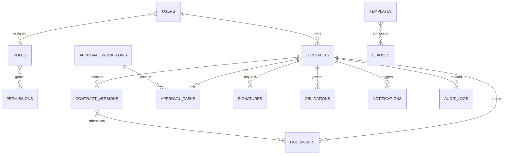

# CovenX Enterprise Contract Lifecycle Management Platform

## Database Design Document

**Status:** Database architecture baseline for review
**Version:** 1.0
**Primary database:** MongoDB
**Supporting data infrastructure:** Redis
**Scope:** Data model, persistence, indexing, scaling, security, and operational strategy. No application code is defined by this document.

> The database design treats each contract as a governed business record connected to versions, documents, approvals, signatures, obligations, notifications, and an immutable audit history.

## 1. Design objectives and principles

The **CovenX Enterprise Contract Lifecycle Management Platform** must support the full lifecycle of Create → Review → Approve → Sign → Monitor → Renew → Archive. The data model is designed for 500,000+ contracts, 25,000 concurrent users, large private document repositories, fast filtered contract searching, reliable approval workflows, and complete traceability.

The design follows these principles:

| Principle | Application |
|---|---|
| Bounded documents | Avoid unbounded arrays and embedded histories in contract records. Store versions, tasks, notifications, documents, and audit events in separate collections. |
| Explicit scope | Include `tenantId`, business-unit, department, ownership, or sharing context wherever access control depends on it. |
| Authoritative state | The `contracts.status` and current-version reference are authoritative; dashboards, caches, and search projections are derived. |
| Immutable history | Contract versions, verified document versions, and audit logs are append-only or correction-by-new-record. |
| Optimistic concurrency | Mutable aggregates carry a version token so conflicting updates fail safely rather than overwriting changes. |
| Query-oriented indexes | Indexes follow documented access patterns, with tenant scope leading security-sensitive compound indexes. |
| Binary separation | MongoDB stores document metadata and storage references; private object storage stores binary content. |
| Recoverable side effects | Outbox/job records and idempotency keys protect notifications, integrations, and background processing. |
| Operational discipline | Schema changes, index changes, retention, backups, and restores are versioned and tested. |

All major collections include `createdAt`, `updatedAt`, `createdBy`, and `updatedBy` where the record is mutable. System-generated records identify the initiating service or scheduler as the actor.

## 2. Logical data architecture

MongoDB references the major aggregates above. A `contractId` is the common correlation key for versions, tasks, signatures, obligations, documents, and related audit events. Referenced entities are resolved through scoped repositories rather than unrestricted joins or client-side authorization assumptions.

## 3. Common field conventions

| Field | Type | Convention |
|---|---|---|
| `_id` | `ObjectId` | MongoDB identifier; never expose storage internals where an opaque public identifier is preferable. |
| `tenantId` | `ObjectId` | Organization or tenant scope; required on tenant-owned collections even if the first deployment is single-tenant. |
| `createdAt`, `updatedAt` | `Date` | UTC timestamps maintained by persistence adapters. |
| `createdBy`, `updatedBy` | `ObjectId` or system actor | User or service identity responsible for the action. |
| `version` | `Long` or integer | Optimistic concurrency token for mutable aggregates. |
| `status` | controlled string enum | State machine value; transitions occur through the workflow service. |
| `metadata` | bounded object | Extensible, validated fields; no unbounded arbitrary payloads. |
| `deletedAt` | nullable `Date` | Soft deletion only where policy permits; audit and legal-hold records are not physically removed by ordinary users. |

Dates are stored as UTC BSON `Date` values. Money is represented as a decimal value with an ISO currency code, preferably using `Decimal128` for financial precision. Emails are normalized for unique lookup. User-provided text is bounded, validated, and escaped at presentation boundaries.

## 4. Collection designs

### 4.1 Users

**Purpose.** Stores human and vendor identities, authentication state, profile data, organization membership, role assignments, and account status.

**Schema design.** One document represents one platform identity. Authentication secrets are minimized and protected; refresh tokens are not stored in plaintext in this collection. Role assignment history or high-volume session records belong in supporting collections.

| Field | Type | Description |
|---|---|---|
| `_id` | `ObjectId` | User identifier. |
| `tenantId` | `ObjectId` | Owning organization. |
| `email` | `String` | Normalized login and notification address. |
| `passwordHash` | `String` | Slow salted password hash; never returned by APIs. Null for external-identity-only users. |
| `authProvider` | `String` | `local`, `sso`, or approved provider identifier. |
| `authVersion` | `Int32` | Incremented to invalidate access tokens and sessions. |
| `profile` | Object | `firstName`, `lastName`, `displayName`, `phone`, `locale`, `timezone`, `avatarRef`. |
| `organization` | Object | `businessUnitIds`, `departmentId`, `jobTitle`, `employeeNumber`, `vendorOrganizationId`. |
| `roleIds` | `[ObjectId]` | Assigned role references. Keep bounded; use assignment collection for large or time-bound grants. |
| `status` | `String` | `invited`, `active`, `suspended`, `deactivated`. |
| `lastLoginAt` | `Date` | Most recent successful login. |
| `createdAt`, `updatedAt`, `createdBy`, `updatedBy` | Common fields | Lifecycle and actor metadata. |

**Relationships.** Users own or act on contracts, approval tasks, obligations, signatures, documents, notifications, and audit events. Roles and permissions are referenced by ID. Sessions and refresh-token records are separate supporting collections.

**Indexes.** Unique `{tenantId: 1, normalizedEmail: 1}`; `{tenantId: 1, status: 1}`; `{tenantId: 1, 'organization.businessUnitIds': 1}`; `{tenantId: 1, 'organization.departmentId': 1}`. Avoid indexing sensitive password material.

**Query optimization.** Authenticate by normalized email and tenant. Project only identity and authorization fields for request context. Do not load profile, role, or session histories for every API request; use scoped cache with short TTL and explicit invalidation.

### 4.2 Roles

**Purpose.** Stores named RBAC bundles and access-scope rules for Super Admin, Legal Officer, Department Manager, Finance Reviewer, Executive Approver, Vendor User, and tenant-specific roles.

**Schema design.** Roles contain references to atomic permissions and explicit scope constraints rather than hard-coded code paths.

| Field | Type | Description |
|---|---|---|
| `_id`, `tenantId` | `ObjectId` | Role and organization scope. Platform roles may use a controlled system scope. |
| `name` | `String` | Human-readable role name. |
| `key` | `String` | Stable machine key such as `legal-officer`. |
| `permissionIds` | `[ObjectId]` | Granted permission references. |
| `scopeRules` | Object | Allowed tenant, business-unit, department, ownership, explicit-share, or task scopes. |
| `isSystemRole` | `Boolean` | Prevents ordinary tenant edits to platform-defined roles. |
| `status` | `String` | `active` or `archived`. |
| `createdAt`, `updatedAt`, `createdBy`, `updatedBy` | Common fields | Governance metadata. |

**Relationships.** Roles reference permissions and are assigned to users. Role changes affect future authorization evaluations and create audit records.

**Indexes.** Unique `{tenantId: 1, key: 1}`; `{tenantId: 1, status: 1}`; `{tenantId: 1, name: 1}`.

**Query optimization.** Load role permissions in a single bounded projection and cache the resolved role graph. Invalidate authorization cache entries on role, permission, or user-assignment changes.

### 4.3 Permissions

**Purpose.** Defines atomic resource-action capabilities used by RBAC and service authorization checks.

**Schema design.** A permission is represented by a stable key such as `contract:approve` and a documented resource/action pair.

| Field | Type | Description |
|---|---|---|
| `_id` | `ObjectId` | Permission identifier. |
| `key` | `String` | Unique stable capability key. |
| `resource` | `String` | `contract`, `document`, `workflow`, `audit`, `report`, `user`, or another governed resource. |
| `action` | `String` | `read`, `create`, `update`, `approve`, `download`, `manage`, `export`, or another controlled action. |
| `description` | `String` | Business meaning and security impact. |
| `scopeType` | `String` | Supported scope such as tenant, business unit, department, ownership, task, or explicit share. |
| `status` | `String` | `active` or `retired`. |
| `createdAt`, `updatedAt` | `Date` | Governance timestamps. |

**Relationships.** Permissions are referenced by roles and evaluated against users and resource scope.

**Indexes.** Unique `{key: 1}`; `{resource: 1, action: 1}`; `{status: 1}`.

**Query optimization.** Permission definitions are reference data and can be cached. Authorization must still fail closed when permission resolution is unavailable or ambiguous.

### 4.4 Contracts

**Purpose.** Main contract aggregate containing searchable metadata, lifecycle status, ownership, parties, dates, and financial information.

**Schema design.** The contract stores the current authoritative summary and references immutable versions, documents, workflows, obligations, and signatures. It does not embed full document content or unbounded history.

| Field | Type | Description |
|---|---|---|
| `_id`, `tenantId` | `ObjectId` | Contract and organization identifiers. |
| `contractNumber` | `String` | Human/business identifier, unique within tenant. |
| `title` | `String` | Searchable contract title. |
| `contractType` | `String` | Vendor, customer, employment, partnership, service, NDA, or governed type. |
| `parties` | Array<Object> | Bounded party summaries with `partyId`, `name`, `role`, `contactRef`. Large party profiles belong in a supporting collection. |
| `ownerId` | `ObjectId` | Primary business owner. |
| `departmentId`, `businessUnitId` | `ObjectId` | Organizational ownership and scope. |
| `status` | `String` | `draft`, `review`, `approval`, `signature`, `active`, `monitoring`, `renewal`, `archived`. |
| `effectiveDate`, `expiryDate` | `Date` | Lifecycle dates. |
| `renewal` | Object | `autoRenew`, `noticeDays`, `renewalWindowStart`, `renewalOwnerId`. |
| `financial` | Object | `value` as `Decimal128`, `currency`, `paymentFrequency`, `paymentTerms`, `costCenter`. |
| `currentVersionId` | `ObjectId` | Current approved or working version. |
| `risk` | Object | `classification`, `score`, `lastAssessedAt`, `assessedBy`. |
| `tags` | `[String]` | Bounded filter tags. |
| `metadata` | Object | Validated tenant-specific metadata. |
| `version` | `Int64` | Optimistic concurrency token. |
| `createdAt`, `updatedAt`, `createdBy`, `updatedBy` | Common fields | Audit and lifecycle metadata. |

**Relationships.** A contract has many versions, approval tasks, signatures, obligations, documents, notifications, and audit records. It references owner, departments, business units, parties, and the current version.

**Indexes.** Unique `{tenantId: 1, contractNumber: 1}`; `{tenantId: 1, status: 1, expiryDate: 1}`; `{tenantId: 1, businessUnitId: 1, status: 1}`; `{tenantId: 1, ownerId: 1, status: 1}`; `{tenantId: 1, contractType: 1, status: 1}`; `{tenantId: 1, 'renewal.renewalWindowStart': 1, status: 1}`. A text or external search index may cover title, number, parties, and approved metadata; do not rely on an unscoped text search for authorization.

**Query optimization.** Use cursor pagination, projection-based list queries, bounded filters, and explain-plan review. Dashboard counts use read-optimized projections or cached aggregates. Search results return contract IDs and safe summaries, then resolve detail through scoped queries.

### 4.5 ContractVersions

**Purpose.** Preserves contract revisions, authorship, change summaries, checksums, and links to prior versions.

**Schema design.** Version documents are append-only after creation. Content is held in a private document reference or normalized structured representation; the full binary is not embedded.

| Field | Type | Description |
|---|---|---|
| `_id`, `contractId`, `tenantId` | `ObjectId` | Version, parent contract, and organization. |
| `versionNumber` | `Int32` | Monotonic version within a contract. |
| `state` | `String` | `draft`, `review`, `approved`, `superseded`, `archived`. |
| `changeSummary` | `String` | Human-readable change description. |
| `authorId` | `ObjectId` | User or service author. |
| `previousVersionId` | `ObjectId` | Immediate predecessor reference. |
| `contentRef` | Object | Document or structured-content reference and checksum. |
| `clauseRefs` | `[ObjectId]` | Clauses used by the version, bounded or externalized for large sets. |
| `createdAt` | `Date` | Version creation timestamp. |

**Relationships.** Belongs to a contract; references prior version, documents, clauses, and audit events.

**Indexes.** Unique `{contractId: 1, versionNumber: 1}`; `{tenantId: 1, contractId: 1, createdAt: -1}`; `{contractId: 1, state: 1}`.

**Query optimization.** Retrieve the latest version with the contract’s `currentVersionId`; retrieve history by contract and descending creation time. Store diffs or comparison artifacts as separate bounded records when comparisons become large.

### 4.6 Templates

**Purpose.** Stores governed authoring templates used to create consistent contract drafts.

**Schema design.** A template is a metadata and composition record with a current version reference. Template content and history should be independently versioned when large.

| Field | Type | Description |
|---|---|---|
| `_id`, `tenantId` | `ObjectId` | Template and organization. |
| `name`, `key` | `String` | Display name and stable identifier. |
| `contractType` | `String` | Intended contract type. |
| `description` | `String` | Purpose and usage guidance. |
| `status` | `String` | `draft`, `published`, `retired`. |
| `currentVersion` | `Int32` | Published/current version number. |
| `clauseRefs` | `[ObjectId]` | Ordered clause references. |
| `variables` | Array<Object> | Bounded placeholder definitions, types, validation, and required flags. |
| `ownerId` | `ObjectId` | Governance owner. |
| `createdAt`, `updatedAt`, `createdBy`, `updatedBy` | Common fields | Governance metadata. |

**Relationships.** Templates compose clauses and are used to create contract versions. Template versions may be stored in a supporting collection.

**Indexes.** Unique `{tenantId: 1, key: 1}`; `{tenantId: 1, contractType: 1, status: 1}`; `{tenantId: 1, ownerId: 1, status: 1}`.

**Query optimization.** Load published templates by contract type and cache them by tenant and version. Keep list responses free of full template bodies.

### 4.7 Clauses

**Purpose.** Governed clause library with categories, risk classification, approval status, and reusable text.

**Schema design.** Clauses are reusable records with controlled versions or append-only revision references. Clause bodies are bounded and may be stored separately if large.

| Field | Type | Description |
|---|---|---|
| `_id`, `tenantId` | `ObjectId` | Clause and organization. |
| `key` | `String` | Stable clause identifier. |
| `title`, `body` | `String` | Display title and approved clause text. |
| `category` | `String` | Confidentiality, liability, payment, termination, SLA, privacy, or other category. |
| `riskClassification` | `String` | `low`, `medium`, `high`, `critical`. |
| `tags` | `[String]` | Search and authoring filters. |
| `status` | `String` | `draft`, `approved`, `deprecated`. |
| `versionNumber` | `Int32` | Current clause version. |
| `ownerId`, `approvedBy` | `ObjectId` | Governance and approval actors. |
| `createdAt`, `updatedAt`, `createdBy`, `updatedBy` | Common fields | Lifecycle metadata. |

**Relationships.** Clauses are composed into templates and referenced by contract versions.

**Indexes.** Unique `{tenantId: 1, key: 1}`; `{tenantId: 1, category: 1, status: 1}`; `{tenantId: 1, riskClassification: 1, status: 1}`; optional scoped text/search index on title, body, and tags.

**Query optimization.** Search only approved clauses by category/risk and project body only when the editor needs it. Use a search service or Atlas Search-style index for phrase and relevance queries rather than broad regex scans.

### 4.8 ApprovalWorkflows

**Purpose.** Versioned definitions for routing contract approvals based on metadata, risk, financial thresholds, business unit, and review domains.

**Schema design.** Workflow definitions are immutable once used by an active contract; a change creates a new definition version.

| Field | Type | Description |
|---|---|---|
| `_id`, `tenantId` | `ObjectId` | Workflow and organization. |
| `name`, `key` | `String` | Human and stable identifiers. |
| `versionNumber` | `Int32` | Definition version. |
| `triggerRules` | Array<Object> | Contract type, value, risk, department, business-unit, or other predicates. |
| `stages` | Array<Object> | Ordered or parallel stages with `stageKey`, required role/assignee, SLA, quorum, and escalation policy. |
| `rejectionPolicy` | Object | Return-to-review or return-to-draft behavior and required reason. |
| `status` | `String` | `draft`, `published`, `retired`. |
| `createdAt`, `updatedAt`, `createdBy`, `updatedBy` | Common fields | Governance metadata. |

**Relationships.** A workflow definition creates approval tasks for contracts and references roles or assignment rules.

**Indexes.** Unique `{tenantId: 1, key: 1, versionNumber: 1}`; `{tenantId: 1, status: 1}`; selective indexes for commonly evaluated trigger dimensions such as `{tenantId: 1, status: 1, 'triggerRules.contractType': 1}`.

**Query optimization.** Keep rules bounded and precompile or normalize common predicates. Select one published definition before creating tasks; persist the selected workflow/version on the contract or task set so later definition changes do not rewrite history.

### 4.9 ApprovalTasks

**Purpose.** Stores actionable review and approval work items, comments, decisions, deadlines, escalation, and timeline evidence.

**Schema design.** One task represents one stage assignment or decision obligation. Comments and timeline events should be bounded or externalized when high volume.

| Field | Type | Description |
|---|---|---|
| `_id`, `tenantId` | `ObjectId` | Task and organization. |
| `contractId`, `workflowId` | `ObjectId` | Parent contract and selected workflow. |
| `stageKey` | `String` | Workflow stage identifier. |
| `assignedUserId`, `assignedRoleId` | `ObjectId` | Direct or role-based assignment. |
| `status` | `String` | `pending`, `in_progress`, `approved`, `rejected`, `delegated`, `expired`, `cancelled`. |
| `decision` | Object | Decision, reason, comments, and timestamp. |
| `dueAt`, `completedAt` | `Date` | SLA deadline and completion. |
| `escalation` | Object | Level, target, lastEscalatedAt, and escalation count. |
| `timeline` | Array/Object | Bounded assignment, reminder, delegation, and decision events; high-volume history uses a separate collection. |
| `version` | `Int64` | Concurrency token. |
| `createdAt`, `updatedAt`, `createdBy`, `updatedBy` | Common fields | Task metadata. |

**Relationships.** Belongs to a contract and workflow; references assignees, roles, and audit events.

**Indexes.** `{tenantId: 1, assignedUserId: 1, status: 1, dueAt: 1}`; `{tenantId: 1, status: 1, dueAt: 1}`; `{tenantId: 1, contractId: 1, status: 1}`; unique idempotency key for a workflow stage and contract execution.

**Query optimization.** Approval inboxes query by assignee/status/due date with projections and cursor pagination. Workers claim due tasks using an indexed status and due-date query plus a short distributed lock.

### 4.10 Signatures

**Purpose.** Tracks internal or external signers, signing status, timestamps, provider references, and evidence.

**Schema design.** Signature records are append-only evidence records with controlled status updates for provider callbacks and completion.

| Field | Type | Description |
|---|---|---|
| `_id`, `tenantId` | `ObjectId` | Signature and organization. |
| `contractId`, `versionId` | `ObjectId` | Signed contract and exact version. |
| `signer` | Object | `userId` or external party reference, name, email, and signing order. |
| `provider` | `String` | `internal`, `simulated`, or approved external provider. |
| `providerEnvelopeId` | `String` | External correlation identifier, protected as sensitive metadata. |
| `status` | `String` | `pending`, `sent`, `viewed`, `signed`, `declined`, `expired`, `voided`. |
| `requestedAt`, `signedAt`, `expiresAt` | `Date` | Signature timeline. |
| `evidenceRef` | Object | Evidence document reference, checksum, and provider event ID. |
| `auditContext` | Object | Request ID, callback verification result, and actor/system source. |
| `createdAt`, `updatedAt` | Common fields | Record metadata. |

**Relationships.** Belongs to a contract version and references internal users or external parties and evidence documents.

**Indexes.** `{tenantId: 1, contractId: 1, status: 1}`; `{tenantId: 1, status: 1, expiresAt: 1}`; unique scoped `{provider: 1, providerEnvelopeId: 1}` where present.

**Query optimization.** Resolve signing status by contract/version and index provider callbacks by envelope ID. Never use provider identifiers as authorization credentials.

### 4.11 Obligations

**Purpose.** Tracks payment, service, deliverable, SLA, renewal, and compliance commitments arising from contracts.

**Schema design.** Each obligation is independently actionable and has an owner, due date, recurrence, priority, status, and escalation policy.

| Field | Type | Description |
|---|---|---|
| `_id`, `tenantId` | `ObjectId` | Obligation and organization. |
| `contractId` | `ObjectId` | Parent contract. |
| `type` | `String` | `payment`, `service`, `deliverable`, `sla`, `renewal`, `compliance`. |
| `title`, `description` | `String` | Commitment summary. |
| `ownerId` | `ObjectId` | Responsible user or team. |
| `dueDate` | `Date` | Next deadline. |
| `recurrence` | Object | Schedule and next occurrence when recurring. |
| `priority` | `String` | `low`, `medium`, `high`, `critical`. |
| `status` | `String` | `open`, `in_progress`, `completed`, `overdue`, `waived`, `cancelled`. |
| `escalation` | Object | Thresholds, escalation target, and last escalation. |
| `evidenceDocumentIds` | `[ObjectId]` | Supporting evidence references. |
| `completedAt`, `completedBy` | `Date`, `ObjectId` | Completion evidence. |
| `createdAt`, `updatedAt`, `createdBy`, `updatedBy` | Common fields | Audit metadata. |

**Relationships.** Belongs to a contract and references owners and evidence documents; due events create notifications and audit records.

**Indexes.** `{tenantId: 1, ownerId: 1, status: 1, dueDate: 1}`; `{tenantId: 1, status: 1, dueDate: 1}`; `{tenantId: 1, contractId: 1, status: 1}`.

**Query optimization.** Workers query open obligations by due-date windows, use cursor pagination, and write idempotent reminder jobs. Dashboard queries use pre-aggregated counts rather than scanning all obligations.

### 4.12 Notifications

**Purpose.** Stores in-app and delivery records for approvals, escalations, expiries, renewals, signatures, obligations, compliance, and document processing.

**Schema design.** Notifications are delivery-oriented records with deduplication and retry state. Template content is versioned outside the recipient record when necessary.

| Field | Type | Description |
|---|---|---|
| `_id`, `tenantId` | `ObjectId` | Notification and organization. |
| `recipientId` | `ObjectId` | Target user. |
| `type` | `String` | Notification event category. |
| `channel` | `String` | `in_app`, `email`, or future channel. |
| `entityRef` | Object | Source entity type and ID. |
| `dedupeKey` | `String` | Idempotency key for event/window. |
| `status` | `String` | `queued`, `sent`, `delivered`, `read`, `failed`, `dead_lettered`. |
| `scheduledAt`, `sentAt`, `deliveredAt`, `readAt` | `Date` | Delivery timeline. |
| `attempts` | `Int32` | Retry count. |
| `lastError` | `String` | Safe failure summary, excluding secrets. |
| `createdAt`, `updatedAt` | Common fields | Record metadata. |

**Relationships.** References recipient and source entities; queue jobs use the notification ID.

**Indexes.** Unique `{tenantId: 1, dedupeKey: 1, channel: 1}`; `{tenantId: 1, recipientId: 1, status: 1, createdAt: -1}`; `{status: 1, scheduledAt: 1}`.

**Query optimization.** Inbox queries use recipient/status/createdAt with a bounded page. Delivery workers claim queued records by scheduled time and status. Apply retention to read delivery records according to policy.

### 4.13 Documents

**Purpose.** Stores metadata, security state, relationships, and private object-storage references for contracts, versions, attachments, policies, amendments, and scanned copies.

**Schema design.** Binary content is never stored in ordinary contract documents. A document record becomes downloadable only after upload finalization, checksum verification, and malware scanning.

| Field | Type | Description |
|---|---|---|
| `_id`, `tenantId` | `ObjectId` | Document and organization. |
| `contractId`, `versionId` | `ObjectId` | Parent contract and optional exact version. |
| `documentType` | `String` | `contract`, `attachment`, `amendment`, `policy`, `scan`, `signature-evidence`. |
| `fileName` | `String` | Display name; object key remains opaque. |
| `mimeType`, `sizeBytes` | `String`, `Int64` | Validated content metadata. |
| `objectStorage` | Object | Provider, bucket/container, opaque key, region, encryption key reference. |
| `checksum` | `String` | Content digest. |
| `classification` | `String` | Data sensitivity classification. |
| `scanStatus` | `String` | `pending`, `clean`, `quarantined`, `failed`. |
| `accessPolicy` | Object | Classification, inherited contract scope, explicit shares, and download rules. |
| `retention` | Object | Retention class, legal hold, and disposal eligibility. |
| `uploadedBy`, `uploadedAt` | `ObjectId`, `Date` | Upload evidence. |
| `createdAt`, `updatedAt` | Common fields | Metadata lifecycle. |

**Relationships.** Belongs to a contract and optionally a contract version; references storage and audit records. Access is evaluated through the contract and document permission scope.

**Indexes.** `{tenantId: 1, contractId: 1, createdAt: -1}`; `{tenantId: 1, versionId: 1}`; `{tenantId: 1, scanStatus: 1, createdAt: 1}`; `{tenantId: 1, 'retention.legalHold': 1, 'retention.disposalAt': 1}`.

**Query optimization.** List metadata without storage secrets or large extracted text. Use contract/version IDs for retrieval. Search document content through a dedicated search index only after authorization-aware result filtering.

### 4.14 AuditLogs

**Purpose.** Append-only compliance history for user actions, contract changes, approvals, downloads, status changes, authentication, authorization failures, and administrative events.

**Schema design.** Audit records are immutable and contain safe summaries, not secrets or unrestricted copies of sensitive documents.

| Field | Type | Description |
|---|---|---|
| `_id`, `tenantId` | `ObjectId` | Audit event and organization. |
| `actorId` | `ObjectId` or system actor | User, service, scheduler, or provider callback actor. |
| `action` | `String` | Stable event such as `contract.created`, `approval.approved`, `document.downloaded`. |
| `entity` | Object | Resource type and resource ID. |
| `oldValue`, `newValue` | Object | Redacted bounded before/after summaries or hashes. |
| `timestamp` | `Date` | Event occurrence time in UTC. |
| `requestId`, `sessionId` | `String` | Correlation and session evidence. |
| `ip` | `String` | Normalized source IP or privacy-approved representation. |
| `userAgent`, `source` | `String` | Client/source context. |
| `result` | `String` | `success`, `failure`, `denied`. |
| `metadata` | Object | Reason, provider event ID, and safe contextual fields. |

**Relationships.** References actor and target entity without owning or mutating it. Contract, document, approval, signature, obligation, and identity operations produce audit records.

**Indexes.** `{tenantId: 1, 'entity.type': 1, 'entity.id': 1, timestamp: -1}`; `{tenantId: 1, actorId: 1, timestamp: -1}`; `{tenantId: 1, action: 1, timestamp: -1}`; time-based retention or archive policy index where supported.

**Query optimization.** Audit searches require tenant and time bounds. Use projections, cursor pagination, export jobs, and archival partitions. Do not expose unbounded `oldValue` or `newValue` payloads in list responses.

## 5. Redis supporting architecture

Redis is supporting infrastructure, not the authoritative database for contracts, permissions, documents, or audit logs. It is used for:

| Redis use | Key pattern example | TTL / durability policy |
|---|---|---|
| Authorization cache | `auth:{tenantId}:{userId}:{authVersion}` | Short TTL; invalidate on role or session changes; fail closed on uncertainty. |
| Contract summary cache | `contract-summary:{tenantId}:{contractId}:{version}` | Short TTL; invalidate on contract mutation; never bypass resource authorization. |
| Dashboard aggregates | `dashboard:{tenantId}:{scope}:{period}` | Short TTL or explicit projection refresh; show freshness metadata. |
| Rate limits | `rate:{scope}:{identity}:{window}` | Window TTL; use atomic counters. |
| Distributed locks | `lock:{resource}:{id}` | Short lease with owner token; release safely and tolerate expiry. |
| Queue jobs | `queue:{name}` | Recoverable queue configuration, retries, dead-letter records, and monitoring. |
| Socket.IO adapter | Authenticated user/tenant room coordination | Ephemeral; rebuilt on reconnect. |
| Idempotency | `idempotency:{tenantId}:{operationKey}` | TTL aligned to mutation retry window; durable result may also be persisted. |

Redis values must not contain plaintext passwords, refresh tokens, storage credentials, signing secrets, or unrestricted sensitive document content.

## 6. Index and search strategy

### 6.1 Compound indexes

Compound indexes lead with `tenantId` on tenant-scoped collections and then follow the most selective or frequently filtered fields. Equality fields generally precede range or sort fields. For example, contract expiry queries use `{tenantId, status, expiryDate}`, while approval inboxes use `{tenantId, assignedUserId, status, dueAt}`. Indexes are created only after query patterns are documented and verified with `explain()`.

The team must monitor index size, selectivity, write amplification, and unused-index reports. Duplicate or overlapping indexes are removed through reviewed migrations. Every index involving authorization scope must preserve the scope predicate in the repository query.

### 6.2 Text and fast contract search

A basic MongoDB text index may support an early title/number/party search, but 500,000+ contracts and relevance, phrase, metadata, and document-content search are better served by a dedicated managed search capability or search collection populated asynchronously from contract/version/document events. Search results must be treated as candidate IDs: the API rechecks tenant, resource scope, status, and permission before returning details.

Searchable fields should include normalized contract number, title, type, party names, tags, approved metadata, clause text where permitted, and extracted document text only after malware and classification controls. Search indexes are eventually consistent and expose indexing status or freshness for operational transparency.

### 6.3 Date and status indexes

Date indexes support expiry, renewal, obligation, approval SLA, signature expiry, notification scheduling, and retention jobs. Status indexes support inboxes, workflow transitions, active-contract dashboards, scan queues, and delivery workers. Date and status fields are often paired with tenant, owner, assignee, or business-unit scope to avoid broad collection scans.

### 6.4 Pagination and projections

All high-volume list endpoints use cursor pagination based on a stable indexed sort such as `(updatedAt, _id)` or `(dueAt, _id)`. Offset pagination is not used for deep contract, audit, notification, or obligation lists. List projections exclude password hashes, storage keys, large clause bodies, binary content, and large audit values.

## 7. Scaling and partitioning strategy

### 7.1 MongoDB deployment and sharding approach

MongoDB starts as a replica set with separate read and write monitoring, encrypted connections, automated backups, and tested restoration. API writes target the primary; carefully selected read workloads may use appropriate read preferences when eventual consistency is acceptable. Transactions are short and limited to related operational records.

The MongoDB sharding approach is introduced after representative workload benchmarking. A likely contract shard key begins with tenant or organization scope and includes a high-cardinality component such as a hashed contract ID, but the final key must balance tenant isolation, query locality, write distribution, and future multi-tenant growth. Monotonic date-only keys are avoided because they can concentrate writes.

Before the 500,000-contract target is reached, benchmark alternate shard-key candidates using production-like distributions. The final sharding key must balance tenant isolation, query locality, write distribution, and future multi-tenant growth. Monotonic date-only keys are avoided because they can concentrate writes.

### 7.2 Data partitioning

Logical partitioning uses `tenantId`, `businessUnitId`, `departmentId`, ownership, and lifecycle state. Contracts remain queryable by tenant and business scope; versions, tasks, documents, obligations, and audit records carry parent IDs and tenant scope to avoid unbounded cross-collection scans. High-volume audit and notification data can be archived independently from active contract metadata.

### 7.3 Archiving and retention

Archived contracts remain discoverable according to retention and legal-hold policies but are removed from hot operational dashboards and default searches. An archive process marks the contract archived, freezes ordinary mutations, retains final versions and audit evidence, and moves cold document binaries or historical projections to lower-cost storage where policy permits.

Retention jobs are idempotent and never delete records under legal hold. Disposal requires policy authorization, a recorded approval, verification that dependent evidence is eligible, and an audit event. Audit logs may use time-based partitions or archive collections while preserving chain-of-custody and exportability.

### 7.4 Concurrency and workload isolation

API, Socket.IO gateways, and queue workers scale horizontally. Background workers use separate concurrency pools for notifications, document processing, search indexing, and reporting so a document or email spike cannot starve approval work. Redis locks are short-lived coordination aids; MongoDB version tokens remain authoritative for conflict detection.

## 8. Security and privacy considerations

Sensitive fields include password hashes, session identifiers, refresh-token hashes, provider envelope IDs, document storage keys, IP addresses, personal profiles, financial terms, contract content, audit metadata, and extracted document text. Access is minimized by projection, encryption, redaction, and role/resource scope.

| Control | Database implementation |
|---|---|
| Encryption in transit | TLS for application-to-MongoDB, Redis, object storage, and provider connections; certificate validation enabled. |
| Encryption at rest | Managed MongoDB, Redis, backups, and object storage encryption with customer or platform-managed keys according to deployment policy. |
| Field protection | Hash refresh tokens; encrypt or tokenize highly sensitive fields; never store raw credentials or signing secrets. |
| Access control | Separate service identities, least-privilege database roles, private network paths, tenant and resource scope in repository queries. |
| File security | Metadata in MongoDB, encrypted binaries in private object storage, malware scanning, checksum verification, quarantine, signed short-lived access. |
| Audit | Append-only audit writes, restricted search/export permissions, audit of audit access, retention and legal-hold enforcement. |
| Injection protection | Typed validation, bounded fields, safe query builders, controlled operators, and protection against regex denial of service. |
| Backup security | Encrypted backups, restricted operators, retention policy, restore tests, and documented recovery objectives. |

MongoDB queries must not accept arbitrary client operators. User-controlled sort fields, filters, projections, and regex patterns are allowlisted. Sensitive values are omitted from logs and error messages.

## 9. Migration, backup, and recovery strategy

Schema changes are versioned as forward-compatible migrations. New fields are introduced as optional, code reads both old and new representations during transition, data backfills are resumable and observable, and old fields are removed only after usage verification. Index migrations are reviewed separately because they affect write load and rollout time.

Backups include MongoDB data, configuration required to interpret encrypted documents, object-storage metadata, queue recovery state where applicable, and key-management references. Recovery objectives, restore ordering, point-in-time recovery, replica failure, Redis rebuild behavior, object-storage loss, and audit integrity are tested in a non-production environment.

Redis is rebuilt from durable sources after failure. MongoDB and object storage are restored before derived caches, dashboard projections, and search indexes. Queue jobs are replayed or reconciled through idempotent records rather than blindly duplicated.

## 10. Data lifecycle and integrity rules

Contract lifecycle transitions are owned by the workflow service and must update the contract state, current-version reference, relevant task state, audit event, and outbox/job intent consistently. Approval, signature, obligation, notification, and document records retain the exact contract/version identifiers that were active at the time of the event.

Referential integrity is enforced through service validation, scoped repository queries, background reconciliation, and indexes rather than assuming MongoDB foreign-key enforcement. Orphan detection jobs identify documents, tasks, versions, notifications, and audit references whose parent records are missing or outside scope. Corrections are performed through governed repair operations and produce audit records.

## 11. Operational query patterns

| Query | Primary collection and index approach |
|---|---|
| Contract inbox by owner/status | `contracts`: `{tenantId, ownerId, status, updatedAt, _id}` |
| Expiring contracts | `contracts`: `{tenantId, status, expiryDate, _id}` |
| Department contract dashboard | `contracts`: `{tenantId, businessUnitId, departmentId, status}` plus aggregate projection |
| Approval inbox | `approvalTasks`: `{tenantId, assignedUserId, status, dueAt, _id}` |
| Overdue obligations | `obligations`: `{tenantId, status, dueDate, _id}` |
| Renewal worker | `contracts`: `{tenantId, status, renewalWindowStart, _id}` |
| Document scan queue | `documents`: `{tenantId, scanStatus, createdAt, _id}` |
| User notification inbox | `notifications`: `{tenantId, recipientId, status, createdAt, _id}` |
| Contract audit history | `auditLogs`: `{tenantId, entity.type, entity.id, timestamp, _id}` |
| Provider callback | `signatures`: `{provider, providerEnvelopeId}` |

## 12. Design review checklist

Before implementation, each new collection or field must identify its owning module, authorization scope, retention class, audit events, write and read patterns, indexes, migration path, sensitive fields, backup implications, and test strategy. The implementation must verify query plans at representative volumes, test concurrent mutations, validate tenant isolation, and exercise backup and restore procedures.

## References

[1]: ./PRD.md "CovenX Product Requirements Document"
[2]: ./Architecture.md "CovenX System Architecture Document"
[3]: ../README.md "CovenX repository README and engineering foundation"
